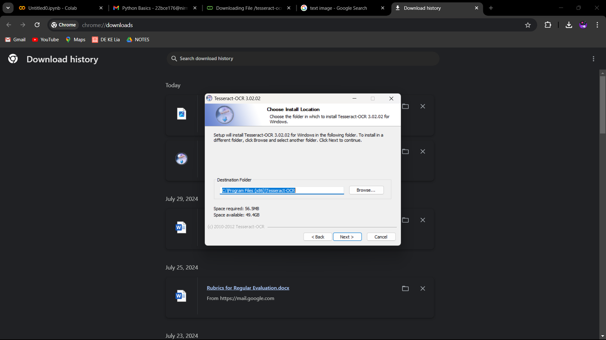
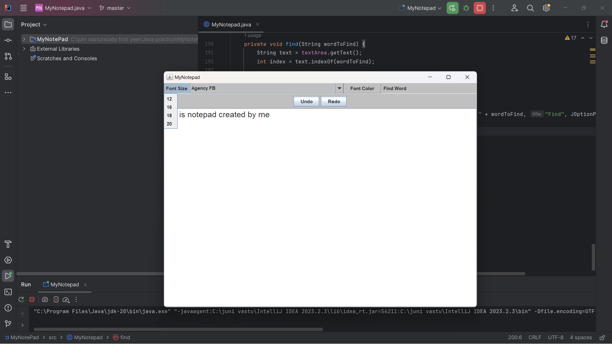
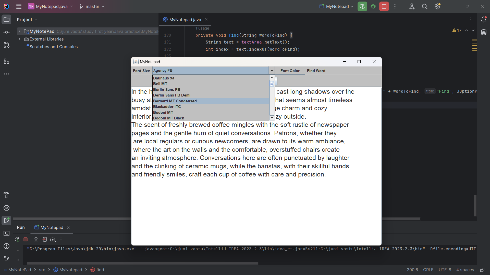
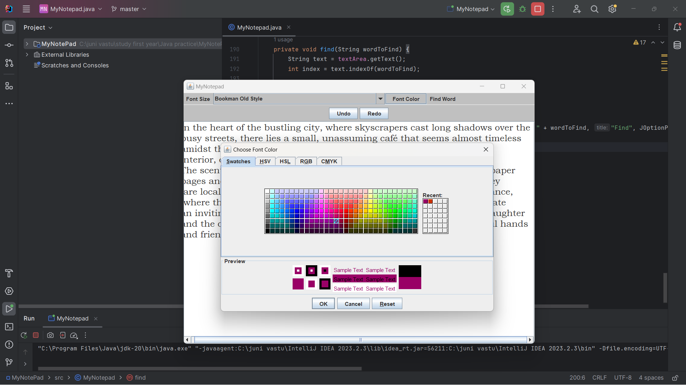
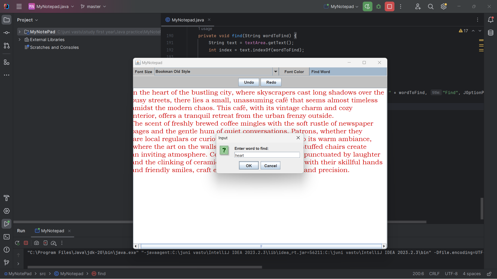
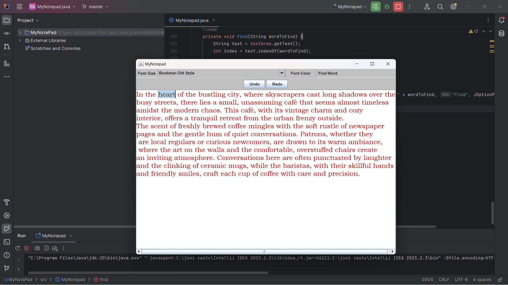

<h1>MyNotepad</h1>
MyNotepad is a simple Java-based text editor application created using Swing. It provides essential text editing features with additional customization options. This project demonstrates the use of Java Swing for building graphical user interfaces and managing user interactions.

Features
Undo/Redo Functionality: Easily revert and reapply changes with undo and redo buttons.
Font Customization:
Font Size: Change the font size from a predefined set of options (12, 16, 18, 20).
Font Family: Select from a variety of available font families.
Font Color: Choose a custom font color using a color picker dialog.
Find Word: Search for and highlight specific words in the text area.

